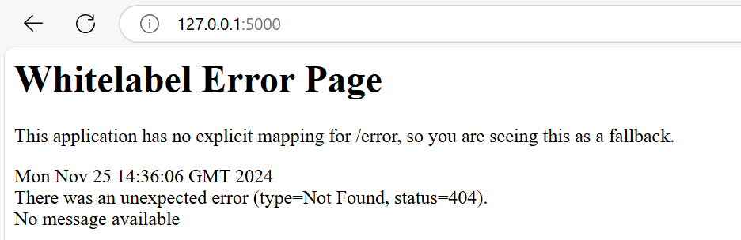
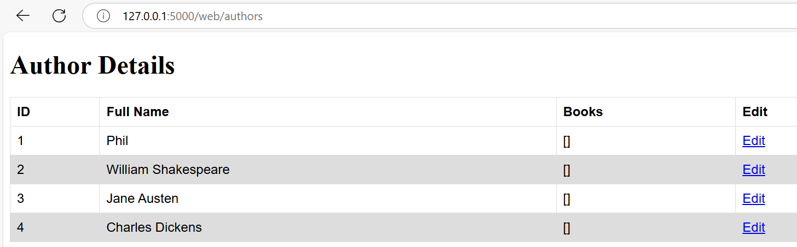

## Stage 2: Full-Stack Setup on Local Machine

### Application Requirements and Setup

#### 1. Java JDK 17

Java Development Kit is the platform required to run and develop Java applications.

Intallation process for Windows 10/11:
1. Navigate to https://www.oracle.com/uk/java/technologies/downloads/#java17-windows and scroll down to find and download JDK vesrion 17.
2. After the package is downloaded, open it and follow the installation window.
3. To confirm installation check the Java version in a terminal.

    ```bash
    java --version
    ```

#### 2. Maven

Maven is a build automation tool used primarily for Java projects. It downloads dependencies, compiles the app, and builds it into a runnable package.

Intallation process for Windows 10/11:
1. Go to the Apache Maven official download page: https://maven.apache.org/download.cgi
2. Download the Binary ZIP archive which typically looks like apache-maven-x.x.x-bin.zip (where x.x.x is the version number).
3. Once it is download it extract the compressed folder. During extraction you will be prompted to set a path to set where the content should be saved. Set your prefered directory should normally be `C:\Program Files\apache-maven-x.x.x-bin`.
4. Navigate into the new directory and hover over the bin folder > right click > copy path.
5. Go to the Windows search bar and look for **Edit the system environment variables**
6. Navigate to Advanced > Environment Variables. Within the system variables list select Path > Edit.
7. Click New and paste the path we copied earlier and Save.
8. To confirm the Maven is installed and recognised, open a bash terminal and execute the following command:

    ```bash
    mvn --version
    ```

### Database Requirements and Setup

#### 1. MySQL

MySQL is an open-source relational database management system (RDBMS) that uses Structured Query Language (SQL) for storing, managing, and retrieving data. It is widely used for web applications, data analytics, and enterprise applications due to its scalability, reliability, and compatibility with various platforms

Intallation process for Windows 10/11:
1. Go to the official Oracle MySQL download page: https://dev.mysql.com/downloads/installer/
2. From here select the MySQL version, OS (Microsoft Windows) and click Download on one of the files. The smaller in size file (recommended) includes an installation process of selecting which components to install like server, client UI (workbench) etc. While the bigger sized file includes everything.
3. After selecting your prefered method follow the installation window to setup and install MySQL.
4. Open File Explorer and locate the folder where MySQL is installed, typically something like: `C:\Program Files\MySQL\MySQL Server 8.0\bin` and copy the path to the bin folder.
5. Go to the Windows search bar and look for **Edit the system environment variables**
6. Navigate to Advanced > Environment Variables. Within the system variables list select Path > Edit.
7. Click New and paste the path we copied earlier and Save.
8. To confirm MySQL is installed and recognised, open a bash terminal and execute the following command:

    ```bash
    mysql --version
    ```

## Running Full-Stack Setup on Local Machine

To run the application and enable it to retrieve data from the database, a few prerequisites must be completed:

* Create and seed the MySQL Database.
* Configure the Datanbase connection environment variable.

### Create and seed the MySQL Database

The application folder contains a `library.sql` file, which includes sql commands that set up the application's database and populate it with initial data. To execute the sql commands do the following:

1. Open the Command Prompt and run the below command to execute the SQL File from the Command Line (Outside MySQL Shell)

    ```cmd
    mysql -u username -p database_name < path\to\your\file.sql
    ```

   * Replace username with your MySQL username (e.g., root).
   * Replace database_name with the name of the database where you want to run the SQL script.
   * Replace path\to\your\file.sql with the path to your .sql file.

    After running the command, you will be prompted to enter the MySQL password. Once entered, the SQL file will execute.

2. Check whether the database has been created by logging in to a mysql shell

    ```cmd
    mysql -u username -p
    ```
3. Run the bellow SQL command to display all databases:

    ```sql
    SHOW DATABASES;
    ```

### Configure the Datanbase Connection Environment Variable.

The application looks for 3 environment variables to establish the database connection and those are DB_HOST, DB_USER and DB_PASS. To configure these variable run the following:

For Command Prompt:
```cmd
set DB_HOST='jdbc:mysql://127.0.0.1:3306/library'
set DB_USER=root
set DB_PASS=xxxx
```

For Git Bash:
```bash
export DB_HOST='jdbc:mysql://127.0.0.1:3306/library'
export DB_USER=root
export DB_PASS=xxxx
```

### Executing Full-Stack Application

After completing the previous configurations, the application should now be able to communicate with the database. To test this, follow these steps:

1. Open a command prompt or git bash terminal session.
2. Navigate to the application folder:

    ```bash
    cd path/to/app
    ```

3. Run the below command to execute the application:

    ```bash
    mvn spring-boot:run
    ```
4. Open a web browser and navigate to the application url: `http://127.0.0.1:5000/`



5. From here you reach other endpoints displaying database entries. For example, navigate to `http://127.0.0.1:5000/web/authors`



## Stage 3: Deploying Full-Stack Application via AWS instances

### Deploying Database

```bash
#!/bin/bash

# Update the system package list
echo Updating package list...
sudo apt-get update -y
echo Done!

# Upgrade all installed packages to their latest versions
echo Upgrading installed packages...
sudo DEBIAN_FRONTEND=noninteractive apt-get upgrade -y
echo Done!

# Installing mysql
sudo DEBIAN_FRONTEND=noninteractive apt install mysql-server -y

# Configuring bindip
sudo sed -i 's/^bind-address\s*=.*/bind-address = 0.0.0.0/' /etc/mysql/mysql.conf.d/mysqld.cnf
sudo sed -i 's/^mysqlx-bind-address\s*=.*/mysqlx-bind-address = 0.0.0.0/' /etc/mysql/mysql.conf.d/mysqld.cnf


# Validating mysql configuration file after bindip change
sudo mysqld --validate-config

# Restarting mysql service to apply bindip changes
sudo systemctl restart mysql

# Download library.sql file from GitHub
curl -u <pat_token>:x-oauth-basic -O https://raw.githubusercontent.com/AdonisAlgos/java-springboot-app/main/library.sql

# Create db user grant temporary global privileges
sudo mysql -e "CREATE USER IF NOT EXISTS 'db_setup'@'%' IDENTIFIED BY 'db_setup';"
sudo mysql -e "GRANT ALL PRIVILEGES ON *.* TO 'db_setup'@'%';"
sudo mysql -e "FLUSH PRIVILEGES;"

# Run library.sql that creates library database and seeds it with arbitrary entries
mysql -u db_setup -pdb_setup < library.sql

# Restrict privileges of created user to only the library db after its creation
sudo mysql -e "REVOKE ALL PRIVILEGES ON *.* FROM 'db_setup'@'%';"
sudo mysql -e "GRANT ALL PRIVILEGES ON library.* TO 'db_setup'@'%';"
sudo mysql -e "FLUSH PRIVILEGES;"
```

### Deploying Application

```bash
#!/bin/bash

# Session Variables
DATABASE_IP="172.31.15.17"
DB_HOST="jdbc:mysql://$DATABASE_IP:3306/library"
DB_USER="db_setup"
DB_PASS="db_setup"

# Update the system package list
echo Updating package list...
sudo apt-get update -y
echo Done!

# Upgrade all installed packages to their latest versions
echo Upgrading installed packages...
sudo DEBIAN_FRONTEND=noninteractive apt-get upgrade -y
echo Done!

# Install JDK 17
echo Installing Java 17...
sudo DEBIAN_FRONTEND=noninteractive apt-get install openjdk-17-jdk -y
echo Done!

# Downloading Maven via binaries to get the latest version
echo Installing Maven...
wget https://dlcdn.apache.org/maven/maven-3/3.9.9/binaries/apache-maven-3.9.9-bin.tar.gz
echo Done!

# Extracting the Archive
echo Extracting the Archive...
tar xzvf apache-maven-3.9.9-bin.tar.gz
echo Done!

# Moving the extracted folder to /opt
echo Moving extracted folder to /opt...
sudo mv apache-maven-3.9.9 /opt/maven
echo Done!

# Adds Maven's bin directory to the PATH, enabling the 'mvn' command globally
echo "Adding Maven to PATH..."
export PATH=/opt/maven/bin:$PATH
echo "Done!"

# Cleanup by removing the downloaded Maven tar.gz file
echo "Cleaning up the downloaded Maven tarball..."
rm apache-maven-*.tar.gz
echo Done!

# Cloning application repo containing the app code to ~/java-springboot-app
echo "Cloning Repo..."
git clone https://AdonisAlgos:<pat_token>@github.com/AdonisAlgos/java-springboot-app.git java-springboot-app
echo Done!

# Setting environment variables to establish a connection between app and database
echo Setting environment variables...
export DB_HOST=$DB_HOST
export DB_USER=$DB_USER
export DB_PASS=$DB_PASS
echo Done!

# Changing working directory to point to the application files
echo Changing working directory...
cd java-springboot-app/LibraryProject2
echo Done!

# Creating a self-contained, executable JAR file to be run in the backround
echo Creating app executable JAR file...
mvn clean package -DskipTests
echo Done!

# Running app in the background
echo Running application...
mvn spring-boot:start
echo Done!
```

## Stage 4: Java Spring Boot App Deployment with Docker Composed on AWS

This project outlines the deployment of a Java Spring Boot application and MySQL database using Docker Compose on an AWS `t2.micro` instance. The application is exposed on port `5000`, and SSH access is available via port `22`.

### Deployment Details

- **AWS Instance**: t2.micro (Ubuntu)
- **Ports Enabled**:
  - **22**: SSH
  - **5000**: Application
- **Services Hosted**:
  - Java Spring Boot Application
  - MySQL Database
- **Docker Compose Network**: Two containers for the application and database

---

### Prerequisites

1. **AWS EC2 Instance**: Ensure the instance has security group rules to allow inbound traffic on ports 22 and 5000.
2. **SSH Access**: Securely connect to the instance using your key pair or other SSH configuration.

---

### Manual Deployment Steps

#### 1. Update and Upgrade the System

These commands ensure the latest security patches and software versions:

```bash
# Updates the system's package list.
sudo apt-get update -y
# Upgrades installed packages.
sudo DEBIAN_FRONTEND=noninteractive apt-get upgrade -y
```

---

#### 2. Install Docker and Docker Compose
Docker is essential for containerized deployment, while Docker Compose helps manage multi-container applications.

1. **Add Docker's GPG key and repository:**

 ```bash
 sudo apt-get install ca-certificates curl
 sudo install -m 0755 -d /etc/apt/keyrings
 sudo curl -fsSL https://download.docker.com/linux/ubuntu/gpg -o /etc/apt/keyrings/docker.asc
 sudo chmod a+r /etc/apt/keyrings/docker.asc

 # Add the repository to Apt sources:
 echo \
     "deb [arch=$(dpkg --print-architecture) signed-by=/etc/apt/keyrings/docker.asc] https://download.docker.com/linux/ubuntu \
     $(. /etc/os-release && echo "$VERSION_CODENAME") stable" | \
     sudo tee /etc/apt/sources.list.d/docker.list > /dev/null
 sudo apt-get update
 ```

2. **Install Docker and its components:**

 ```bash
 sudo DEBIAN_FRONTEND=noninteractive apt-get install docker-ce docker-ce-cli containerd.io docker-buildx-plugin docker-compose-plugin -y
 ```

---

#### 3. Clone the Application Repository
Cloning the repository retrieves the application source code:

```bash
git clone https://AdonisAlgos:<pat_token>@github.com/AdonisAlgos/java-springboot-app.git java-springboot-app
```

---

#### 4. Create the Application Dockerfile
The Dockerfile defines how the application container will be built.

```bash
# Creates and opens the Dockerfile for editing.
nano Dockerfile
```

Contents of Dockerfile:
```dockerfile
# Base image with Maven and Java
FROM maven:3.9.5-eclipse-temurin-17

# Set the working directory inside the container
WORKDIR /app

# Copy the project files into the container
COPY ./java-springboot-app/LibraryProject2 .

# Build the application
RUN mvn clean package -DskipTests

# Expose the application port
EXPOSE 5000

# Run the built jar file
CMD ["java", "-jar", "target/LibraryProject2-0.0.1-SNAPSHOT.jar"]
```

Purpose:

- Base image: Provides Maven and Java development tools.
- Copies the source code into the container.
- Builds the application using Maven.
- Exposes port 5000 for external access.
- Defines the command to run the app.

#### 5. Build and Push the Docker Image

1. **Build the Docker image:**

```bash
# Builds the image with the specified tag.
docker build -t adonisdev/java-bootstrap-app:v1 .
```

2. **Push the image to Docker Hub:**
   
```bash
docker push adonisdev/java-bootstrap-app:v1  # Uploads the image to Docker Hub for reuse.
```

---

#### 6. Create the Docker Compose File
The docker-compose.yml orchestrates multiple containers into a network.

```bash
# Creates and opens the Docker Compose file.
nano docker-compose.yml
```

Contents of docker-compose.yml:
```yml
version: "3.8"
services:
  mysql:
    image: mysql:latest
    container_name: mysql_container
    ports:
      - "3306:3306"          # Exposes MySQL port
    environment:
      MYSQL_ROOT_PASSWORD: root_password
      MYSQL_DATABASE: library
      MYSQL_USER: db_setup
      MYSQL_PASSWORD: db_setup
    volumes:
      - mysql_data:/var/lib/mysql
      - ./library.sql:/docker-entrypoint-initdb.d/library.sql
    healthcheck:
      test: ["CMD", "mysqladmin", "ping", "-h", "localhost"]
      interval: 10s
      timeout: 5s
      retries: 3

  app:
    image: adonisdev/java-bootstrap-app:v1
    container_name: app_container
    ports:
      - "5000:5000"          # Exposes the application port
    environment:
      DB_HOST: "jdbc:mysql://mysql:3306/library"
      DB_USER: "db_setup"
      DB_PASS: "db_setup"
    depends_on:
      mysql:
        condition: service_healthy
volumes:
  mysql_data:
```

Purpose:

- Defines services for MySQL and the application.
- Configures environment variables for database connection.
- Ensures MySQL service is healthy before starting the app.

---

#### 7. Deploy the Services
Run the Docker Compose file:

```bash
# Launches the services in detached mode.
docker compose up -d
```

---

### Verifying the Deployment
1. **Check Container Health.** List running containers and check their status:

```bash
docker ps
```
2. **Access the Application.** Open a browser and navigate to http://<instance_public_ip>:5000/web/authors.

---

### Troubleshooting
- Ports Are Blocked. Verify security group rules for inbound traffic on ports 22 and 5000.
- Container Issues. Inspect container logs for errors:
```bash
docker logs <container_name>
```

---

### Automated Java Spring Boot App Deployment on AWS with Docker Compose via a Linux script

This section provides instructions to automate the provisioning and deployment of a Java Spring Boot application and MySQL database using Docker Compose on an AWS EC2 instance. The automation is done using a shell script provided in the EC2 **User Data** during instance creation. Script breakdown:

#### 1. Updating and Upgrading the System

```bash
apt-get update -y
DEBIAN_FRONTEND=noninteractive apt-get upgrade -y
```

**Purpose:**
- Ensures the system package list is up to date (apt-get update).
- Upgrades all installed packages to their latest stable versions to include security patches and bug fixes (apt-get upgrade).

#### 2. Installing Docker and Docker Compose

```bash
sudo apt-get install ca-certificates curl
sudo install -m 0755 -d /etc/apt/keyrings
sudo curl -fsSL https://download.docker.com/linux/ubuntu/gpg -o /etc/apt/keyrings/docker.asc
sudo chmod a+r /etc/apt/keyrings/docker.asc

# Add the repository to Apt sources:
echo \
    "deb [arch=$(dpkg --print-architecture) signed-by=/etc/apt/keyrings/docker.asc] https://download.docker.com/linux/ubuntu \
    $(. /etc/os-release && echo "$VERSION_CODENAME") stable" | \
    sudo tee /etc/apt/sources.list.d/docker.list > /dev/null
sudo apt-get update
sudo DEBIAN_FRONTEND=noninteractive apt-get install docker-ce docker-ce-cli containerd.io docker-buildx-plugin docker-compose-plugin -y
```

**Purpose:**
- Installs Docker's official GPG key (curl and ca-certificates ensure secure downloads).
- Adds Docker's repository to the system's package manager sources, enabling installation of Docker packages.
- Installs Docker (docker-ce, docker-ce-cli, containerd.io) and Docker Compose plugin.
- This step ensures that the EC2 instance can run Docker containers and orchestrate them using Docker Compose.

#### 3. Creating a directory for the Docker Compose project

```bash
mkdir prov-app-db-docker-compose
cd prov-app-db-docker-compose
```
**Purpose:**
- This directory will serve as the Docker Compose project location and name, which is a requirement.
- Additionally, any files within this directory can be referenced and utilized by Docker Compose to complete the application and database setup.

#### 4. Downloading the library.sql file from GitHub

```bash
curl -u <pat_token>:x-oauth-basic -O https://raw.githubusercontent.com/AdonisAlgos/java-springboot-app/main/library.sql
```

**Purpose:**
- Fetches the databases's seed code from the GitHub repository.
- This ensures the database source script is available on the EC2 instance within the docker compose project.

#### 5. Create Docker Compose Configuration:

```bash
cat <<EOL > ./docker-compose.yml
services:
  mysql:
    image: mysql:latest
    container_name: mysql_container
    ports:
      - "3306:3306"
    environment:
      MYSQL_ROOT_PASSWORD: root_pass
      MYSQL_DATABASE: library
      MYSQL_USER: db_setup
      MYSQL_PASSWORD: db_setup
    volumes:
      - mysql_data:/var/lib/mysql
      - ./library.sql:/docker-entrypoint-initdb.d/library.sql
    healthcheck:
      test: ["CMD", "mysqladmin", "ping", "-h", "127.0.0.1"]
      interval: 10s
      timeout: 5s
      retries: 3

  app:
    image: adonisdev/java-bootstrap-app:v1
    container_name: app_container
    ports:
      - "5000:5000"
    environment:
      DB_HOST: "jdbc:mysql://mysql:3306/library"
      DB_USER: db_setup
      DB_PASS: db_setup
    depends_on:
      mysql:
        condition: service_healthy

volumes:
  mysql_data:
EOL
```

**Purpose:**

Creates the docker-compose.yml file to configure and orchestrate:
- MySQL Database: Sets up a database container with user credentials and a health check.
  - `ports: - "3306:3306"`: Maps port 3306 on the host machine to port 3306 inside the MySQL container, allowing external access to the database.
  - `environment`: Configures the MySQL database credentials and initialization settings.
    - `MYSQL_ROOT_PASSWORD`: Sets the root user password for the database.
    - `MYSQL_DATABASE`: Creates a new database named library.
    - `MYSQL_USER`: Creates a non-root user named db_setup.
    - `MYSQL_PASSWORD`: Sets the password for the non-root user.
  - `volumes`: Ensures persistent storage for the database data and initializes the database schema with an SQL script.
    - `mysql_data:/var/lib/mysql`: Maps the MySQL data directory to a named volume (mysql_data) to persist database data across container restarts.
    - `./library.sql:/docker-entrypoint-initdb.d/library.sql`: Mounts the library.sql file into MySQL’s initialization directory to run custom database setup scripts during the container’s first run.
  - `healthcheck`: Ensures the MySQL container is healthy before other services that depend on it start.
- Application Container: Runs the Java Spring Boot application container after ensuring the database is healthy.
  - `ports: - "5000:5000"`: Maps port 5000 on the host machine to port 5000 inside the application container, exposing the application to external traffic.
  - `environment`: Configures database connection settings for the application.
    - `DB_HOST`: Specifies the JDBC URL for connecting to the MySQL database service (e.g., mysql:3306).
    - `DB_USER`: The database username (matches MYSQL_USER from the MySQL service).
    - `DB_PASS`: The database password (matches MYSQL_PASSWORD from the MySQL service).
  - `depends_on`: Ensures the application container starts only after the mysql service is healthy.
    - `condition: service_healthy`: Waits for the MySQL container to pass its health check before starting the application.
- Volume Block: Persists database data.
  - `volumes: mysql_data:`: Defines a named volume (mysql_data) to store the MySQL database files persistently. This ensures the database is not lost if the MySQL container is restarted or recreated.

#### 6. Start Containers with Docker Compose:

```bash
sudo docker compose up -d
```
**Purpose**:
- Starts all containers defined in the docker-compose.yml file in detached mode (-d).

#### 7. Verifying running containers

```bash
docker ps
```

**Purpose**:
- Displays all running containers for service verification and logging purposes.

---

### Final Notes

This provisioning process automates the setup of an AWS instance with Docker and Docker Compose, prepares the application, and launches all required containers. By following this breakdown, the environment will be ready for immediate use. Find the full script here: [Automated App & Database Provisioning Script via Docker Composed](provision-app-db-with-docker-compose.sh)

---


